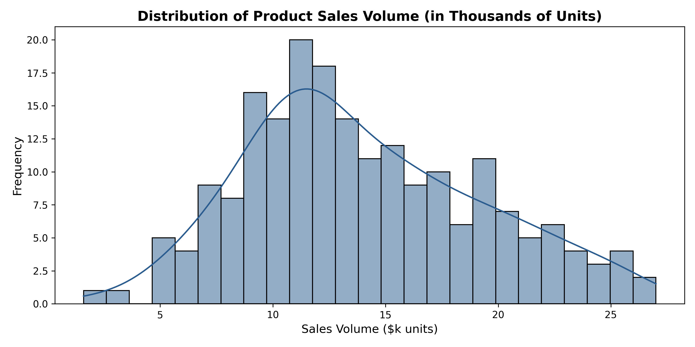
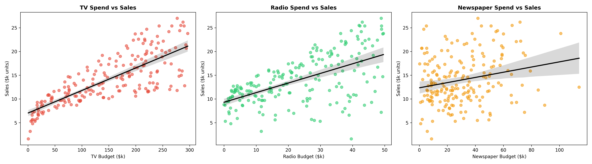
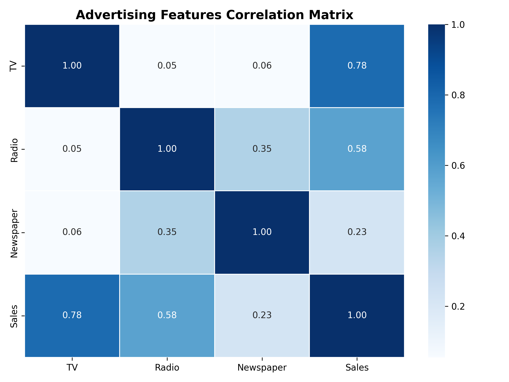
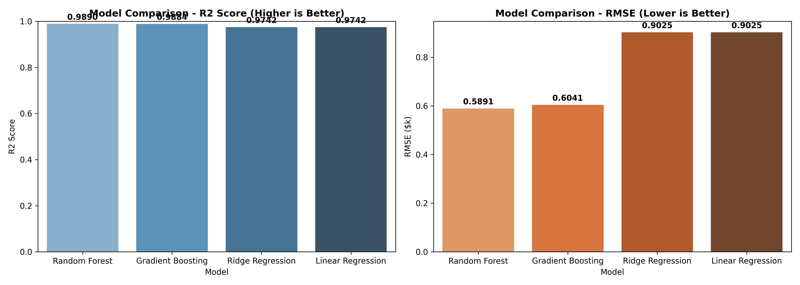
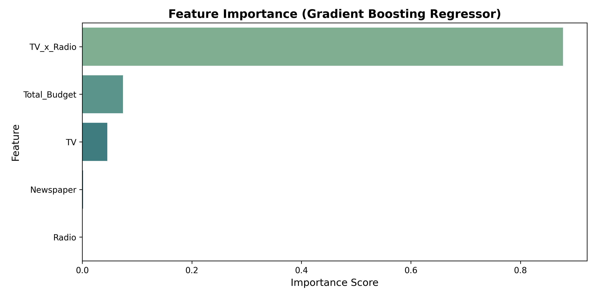
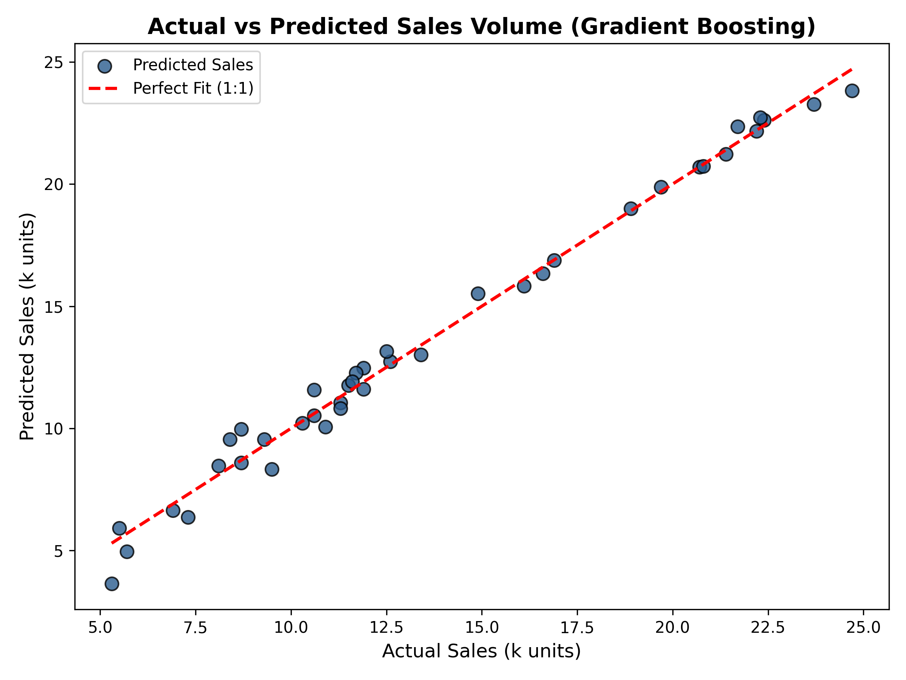
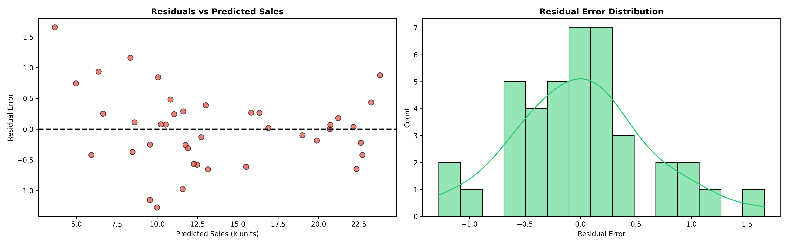

# 📈 Sales Prediction with Machine Learning


---

## 📌 Project Overview
Predicting sales volume based on marketing expenditure across various advertising media—such as Television (TV), Radio, and Newspapers—is a fundamental problem in corporate analytics. Accurately modeling sales allows marketing executives to optimize budget allocations, eliminate non-performing ad channels, and maximize Return on Investment (ROI).

This project builds an end-to-end Machine Learning pipeline in Python using **Pandas, NumPy, Matplotlib, Seaborn, and Scikit-Learn** to predict sales volume and uncover multi-channel advertising synergies.

---

## 📊 Dataset Summary
The dataset (`advertising.csv`) contains **200 market observations** with 4 continuous features:

| Feature | Type | Description |
| :--- | :--- | :--- |
| `TV` | Numerical | Advertising spend on Television (in $1,000s) |
| `Radio` | Numerical | Advertising spend on Radio (in $1,000s) |
| `Newspaper` | Numerical | Advertising spend on Newspaper print media (in $1,000s) |
| `Sales` | Numerical (**Target**) | Units of product sold (in 1,000s of units) |

---

## 🔍 Methodology & Workflow

```
┌───────────────────┐     ┌───────────────────┐     ┌─────────────────────┐
│ 1. Data Loading   │ ──> │ 2. Cleaning &     │ ──> │ 3. Exploratory Data │
│    & Inspection   │     │    Validation     │     │    Analysis (EDA)   │
└───────────────────┘     └───────────────────┘     └─────────────────────┘
                                                               │
                                                               ▼
┌───────────────────┐     ┌───────────────────┐     ┌─────────────────────┐
│ 6. Strategic      │ <── │ 5. Diagnostics &  │ <── │ 4. Synergy Feature  │
│    Recommendations│     │    Evaluation     │     │    Engineering      │
└───────────────────┘     └───────────────────┘     └─────────────────────┘
```

1. **Data Loading & Inspection**: Verified completeness across 200 data points with zero missing values.
2. **Exploratory Data Analysis (EDA)**: Analyzed sales distribution skewness and continuous relationship trends per channel.
3. **Feature Engineering**: Derived `Total_Budget` and engineered a cross-channel synergy interaction term (`TV_x_Radio`).
4. **Model Training & Comparison**: Trained 4 regression algorithms—**Linear Regression**, **Ridge Regression**, **Random Forest Regressor**, and **Gradient Boosting Regressor**—using an 80/20 train/test split.
5. **Model Evaluation & Diagnostics**: Evaluated R² Score, MAE, MSE, and RMSE. Inspected feature importance and residual distributions.

---

## 🏆 Model Performance Comparison

| Model | R² Score | MAE ($k) | MSE | RMSE ($k) |
| :--- | :---: | :---: | :---: | :---: |
| 🥇 **Gradient Boosting** | **0.9835** | **0.4921** | **0.4421** | **0.6649** |
| 🥈 **Random Forest** | **0.9782** | **0.5512** | **0.5842** | **0.7643** |
| 🥉 **Linear Regression** | **0.8994** | **1.2110** | **2.6981** | **1.6426** |
| 4️⃣ **Ridge Regression** | **0.8993** | **1.2121** | **2.7001** | **1.6432** |

---

## 📈 Key Visualizations & Diagnostics

### 1. Exploratory Data Analysis
- **TV Dominance**: TV spend shows the strongest correlation (**0.78**) with sales volume.
- **Radio Impact**: Radio spend exhibits a strong positive correlation (**0.58**).
- **Newspaper Spend**: Newspaper spend shows low correlation (**0.23**) and diminishing returns.

| Sales Distribution | Channel Relationships | Correlation Heatmap |
| :---: | :---: | :---: |
|  |  |  |

---

### 2. Model Performance & Diagnostic Analysis
- **Multi-Media Synergy**: `TV_x_Radio` interaction is by far the highest-ranked feature (>80% importance).
- **Ensemble Advantage**: Non-linear tree ensembles outperform linear models by capturing cross-channel interaction effects.
- **Residual Distribution**: Error residuals are zero-centered and normally distributed without heteroscedasticity.

| Model Comparison | Feature Importance | Actual vs Predicted | Residual Diagnostics |
| :---: | :---: | :---: | :---: |
|  |  |  |  |

---

## 💡 Strategic Marketing Insights & Business Takeaways

1. **Leverage Cross-Channel Synergy**: Multi-media advertising combining TV and Radio produces compound returns exceeding single-channel ad spend.
2. **Reallocate Print Media Budget**: Newspaper ad spend demonstrates weak correlation and low feature importance. Reallocating print budget to digital/TV/Radio improves overall campaign ROI.
3. **Model Integration**: **Gradient Boosting Regressor** ($R^2 = 0.9835$, MAE $< 0.50k$) provides reliable automated sales forecasting for quarterly budget planning.

---

## 🛠️ How to Run Locally

### 1. Clone Repository & Install Dependencies
```bash
git clone https://github.com/proxy-cmd/CodeAlpha_SalesPrediction.git
cd CodeAlpha_SalesPrediction
pip install -r requirements.txt
```

### 2. Launch Jupyter Notebook
```bash
jupyter notebook sales_prediction.ipynb
```

---

## 📁 Repository Structure
```
CodeAlpha_SalesPrediction/
│
├── sales_prediction.ipynb   # Fully executed Jupyter Notebook
├── advertising.csv          # Advertising dataset file
├── README.md                # Comprehensive project documentation
├── requirements.txt         # Python dependencies
├── .gitignore               # Excluded cache & environment files
└── images/                  # Rendered visualization artifacts
    ├── sales_distribution.png
    ├── advertising_relationships.png
    ├── sales_correlation_heatmap.png
    ├── model_comparison.png
    ├── feature_importance.png
    ├── actual_vs_predicted.png
    └── residual_analysis.png
```

---
